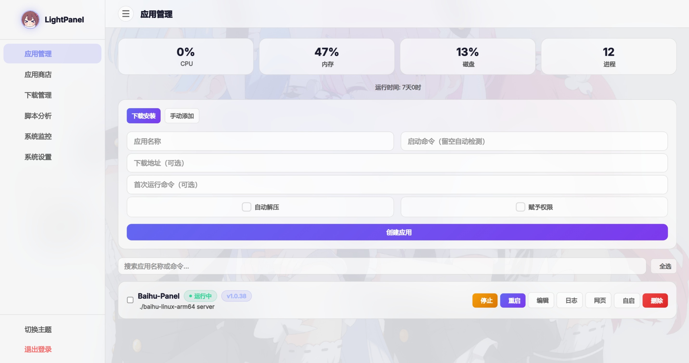
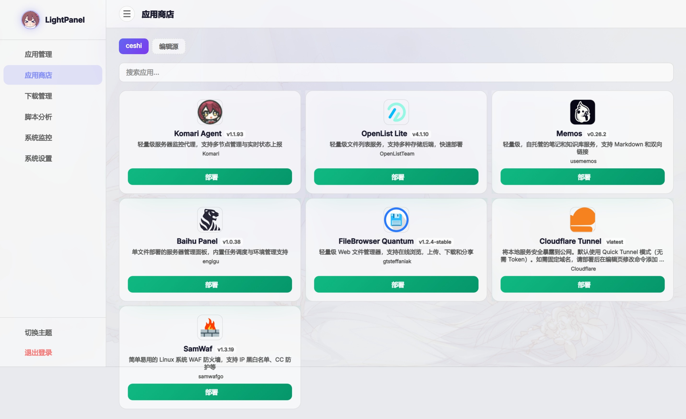
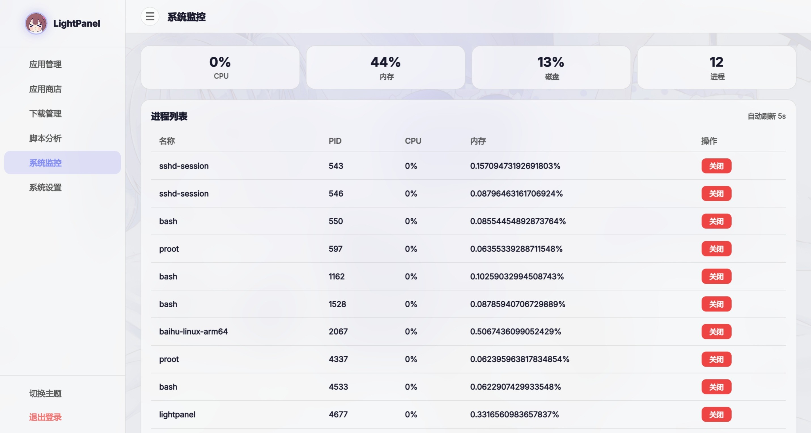

<p align="center">
  <h1 align="center">🚀 朱雀面板 LightPanel</h1>
  <p align="center">一个极简的 Linux 服务器自部署二进制项目管理面板 | 单二进制 · 零依赖 · 无Docker</p>
  <p align="center">
    
    
    
    
  </p>
</p>

---

## ✨ 项目简介
朱雀面板（LightPanel）是一款**专为轻量Linux设备设计**的极致轻量服务器管理面板，核心定位是「单二进制、零依赖、无Docker」，让软路由、旧手机、ARM开发板、小服务器等无法运行Docker的设备，也能拥有现代化的自托管项目管理体验。

无需Docker、无需systemd、无需数据库，**一个二进制文件即可运行整个面板**，真正做到开箱即用，资源占用仅10MB级。

---

## 💡 为什么做这个面板？
很多路由器、软路由（OpenWrt）、旧手机、ARM开发板等轻量设备，受限于硬件/系统，无法运行Docker，传统的容器化管理方案（1Panel、宝塔等）完全无法使用。

LightPanel 朱雀面板彻底解决这个痛点：
- 纯Go语言编译，单二进制文件，全架构支持（x86_64/arm64/armv7等）
- 无需任何依赖，无需Docker、无需systemd、无需数据库
- 内置现代化应用商店，支持二进制项目一键下载、部署、管理
- 完美适配OpenWrt、旧手机（Termux）、ARM设备等所有Linux环境

---

## ✨ 特性

| 模块 | 说明 |
|------|------|
| 🚀 **零依赖部署** | 单二进制文件，无需 Docker / systemd / 数据库 |
| 🏪 **二进制应用商店** | 支持多源 JSON 拉取，一键下载部署，自动检测启动命令 |
| 📥 **下载管理** | 异步下载、暂停/继续、断点续传、实时进度 |
| 🛡️ **进程守护** | 启停/重启/删除、开机自启、崩溃自动重启（最多 3 次/5 分钟） |
| 📝 **日志管理** | 自动轮转、按错误关键词过滤、一键清空 |
| 📊 **系统监控** | CPU/内存/磁盘/实时进程列表、进程管理 |
| 🔍 **启动失败检测** | 自动分析日志，提示缺失依赖 |
| ✏️ **编辑应用** | 修改路径、命令、工作目录、网页地址、重命名 |
| 📜 **脚本分析** | 分析安装脚本，提取依赖包、端口号、环境变量 |
| 🎨 **主题切换** | 深色/浅色模式即时切换，支持系统偏好，侧栏折叠记忆 |
| 🖼️ **自定义 Logo** | 侧栏页头支持自定义图片 |
| 🖼️ **自定义 page** | 个性化定制页面 |
| 🖼️ **自定义 背景** | 支持自定义背景图片 |
| 🔒 **安全加固** | 登录限流、CSRF Token、命令白名单、SSRF 防护 |
| 💾 **备份还原** | 完整数据备份/恢复，支持 exclude 目录 |

## 🎯 面板展示




## 🎯 适用场景

适用于管理单二进制或脚本类自部署项目，如：

[AList](https://github.com/alist-org/alist) · [Memos](https://github.com/usememos/memos) · [哪吒探针](https://github.com/nezhahq/agent) · [frp](https://github.com/fatedier/frp) · [sing-box](https://github.com/SagerNet/sing-box) 等

## 📦 快速部署

### 一键安装 (Linux)

```bash
curl -L https://gh.llkk.cc/https://github.com/MyUI0/lightpanel/releases/latest/download/install.sh | bash
```


### 手动安装

```bash
# amd64/arm64   教程为amd64的
wget https://github.com/MyUI0/lightpanel/releases/latest/download/lightpanel-linux-amd64.tar.gz
tar -xzf lightpanel-linux-amd64.tar.gz
chmod +x lightpanel
./lightpanel
```

> 注意: 树莓派请使用 arm64 版本

### 编译安装

```bash
# 1. 下载源码
git clone https://github.com/MyUI0/LightPanel.git
cd LightPanel

# 2. 编译
go build -o lightpanel .

# 3. 运行
chmod +x lightpanel
./lightpanel
```

> 💬 如遇编译问题，请查看 [FAQ.md](FAQ.md)

默认访问 `http://127.0.0.1:31956`，初始账号密码 `admin / admin`。

> ⚠️ **首次登录后请立即修改密码！**

## 🛡️ 安全提醒

- ❌ **不建议将面板端口暴露到公网**，本项目安全性有限，建议通过内网访问或使用 Nginx/Caddy 反代 + HTTPS
- ✅ 如需公网访问，请务必配置反向代理、防火墙规则，并修改默认密码
- 🛡️ 命令白名单和 SSRF 防护可降低部分风险，但无法完全消除

## 📂 项目结构

```
main.go              # 入口
config/config.go     # 配置常量
models/models.go     # 数据模型
handlers/
  auth.go            # 认证 + 登录限流 + CSRF + 会话管理
  routes.go          # 路由注册 + 安全中间件
  security.go        # 命令白名单 + 内网 IP 拦截
  utils.go           # JSON 读写 + 初始化
  templates.go       # 所有页面 HTML/CSS/JS（改 UI 只需改此文件）
  page_dashboard.go  # 仪表盘 + 系统监控
  page_store.go      # 应用商店 + 源管理
  page_settings.go   # 设置 + 日志 + 进程管理
  page_edit.go       # 编辑应用
  app.go             # 应用核心逻辑 + watchdog
  app_control.go     # 应用控制
  app_create.go      # 应用创建
  downloads.go       # 下载管理
  script_analyze.go  # 脚本分析
  detect.go          # 可执行文件检测
  extract.go         # 压缩包解压
  backup.go          # 备份还原
  notify.go          # Bark 推送
  hooks.go           # 钩子脚本
```

## 🎨 修改 UI

所有页面集中在 `handlers/tpl_*.go`，改完 `go build` 即可，无需构建工具。

## 🏪 商店源规则

欢迎制作自己的应用商店源！只需提供一个返回 JSON 数组的 HTTP 地址即可。

### JSON 字段说明

| 字段 | 必填 | 说明 |
|------|------|------|
| `name` | ✅ | 应用名称 |
| `desc` | ✅ | 应用描述 |
| `icon` | ❌ | 图标 URL |
| `url` | ✅ | 下载地址，支持 `{{arch}}` 和 `{{os}}` 占位符 |
| `cmd` | ❌ | 启动命令，支持 `{{arch}}` 和 `{{os}}` 占位符 |
| `port` | ❌ | 默认端口号 |
| `setup_cmd` | ❌ | 首次运行命令（仅执行一次） |
| `auto_extract` | ❌ | 自动解压压缩包 (true/false) |
| `make_exec` | ❌ | 自动设置可执行权限 (true/false) |
| `params` | ❌ | 允许用户输入的参数 |
| `author` | ❌ | 作者 |
| `version` | ❌ | 版本号 |
| `home_url` | ❌ | 官方主页 |

### 占位符说明

- `{{arch}}` - 自动替换为系统架构 (amd64, arm64, armv7)
- `{{os}}` - 自动替换为系统类型 (linux, darwin)
- `{{params}}` - 用户自定义参数（需商店启用参数功能）

### 示例

```json
[
  {
    "name": "baihu",
    "desc": "白虎面板 - 轻量级面板",
    "icon": "https://example.com/icon.png",
    "url": "https://example.com/baihu-linux-{{arch}}.tar.gz",
    "cmd": "./baihu-linux-{{arch}} server",
    "port": 8080,
    "auto_extract": true,
    "author": "author"
  }
]
```

然后在面板的"源管理"页面添加你的源地址即可。

### 商店源

- [https://gh.llkk.cc/https://raw.githubusercontent.com/MyUI0/lightpanel-store/refs/heads/main/yuan/source.json]

## ⚖️ 免责声明

1. 本项目为个人学习/工具用途，作者不对使用本项目造成的任何数据丢失、系统故障或安全事件负责。
2. 本项目由 AI 辅助编写，结合个人需求简单开发，代码可能存在未发现的边界情况，请自行测试后部署。
3. 请勿在生产环境中直接使用，建议先在测试环境验证。
4. 使用本项目即表示您同意自行承担所有风险。

## 📄 许可证

[MIT License](LICENSE)
